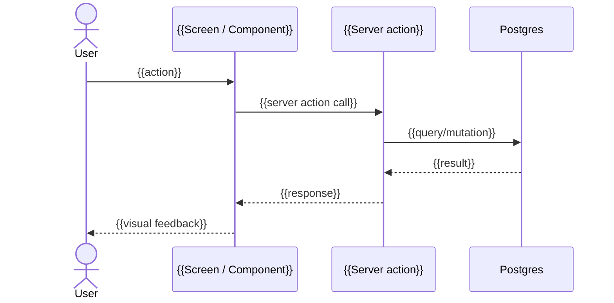

# FLW-{{NN}} — {{Flow name}}

> **One file per multi-screen flow** (≥2 screens). Skip emission if the feature fits in 1 screen — flow details go in the SCR directly.

## 1. Purpose

{{1-2 sentences. What user goal does this flow accomplish? What persona is the primary actor? Anchor to JTBD from `02_PERSONAS.md`.}}

## 2. Trigger

{{Event, button, deep link, scheduled job, or external signal that initiates this flow. Reference the source: SCR-XXX `## 10 Interaction details` entry, or `10_API_SURFACE.md` webhook spec, etc.}}

## 3. Sequence diagram

## 4. Steps (narrative)

| #   | Screen / Component | User action | System response | State transition                  |
| --- | ------------------ | ----------- | --------------- | --------------------------------- |
| 1   | SCR-XXX            | {{action}}  | {{response}}    | {{state field A → state field B}} |
| 2   | SCR-YYY            | {{action}}  | {{response}}    | {{...}}                           |
| 3   | …                  | …           | …               | …                                 |

## 5. Success path (happy)

{{Bullet list. Where does the flow end? What is the user's final state? Any toast, modal, redirect?}}

## 6. Error paths

| Error scenario            | At step | UI treatment                                    | Recovery path                            |
| ------------------------- | ------- | ----------------------------------------------- | ---------------------------------------- |
| {{e.g., network failure}} | {{N}}   | {{e.g., toast destructive + retain form state}} | {{e.g., retry button + back to SCR-XXX}} |
| {{validation error}}      | {{N}}   | {{inline field error}}                          | {{user corrects → resubmit}}             |
| {{auth/RBAC mismatch}}    | {{N}}   | {{redirect to login or 403 screen}}             | {{out-of-flow}}                          |
| {{server error 5xx}}      | {{N}}   | {{banner destructive + retry}}                  | {{retry → success OR cancel → back}}     |

## 7. Refs

- **Features:** FT-XX (from `03_DEEP_DIVE.md`)
- **Personas:** PER-XXX (from `02_PERSONAS.md`)
- **Acceptance scenarios:** AC-XX (from `06_ACCEPTANCE_SCENARIOS.md` — Gherkin)
- **Screens:** SCR-XXX, SCR-YYY (from `16_DESIGN/`)
- **Server actions:** `actionName` (from `10_API_SURFACE.md §X.Y`)
- **Packet:** `15_IMPLEMENTATION_PACKETS/FT-XX.md`

---

_TimeKast Factory — tk-design template · FLW-{{NN}}_
